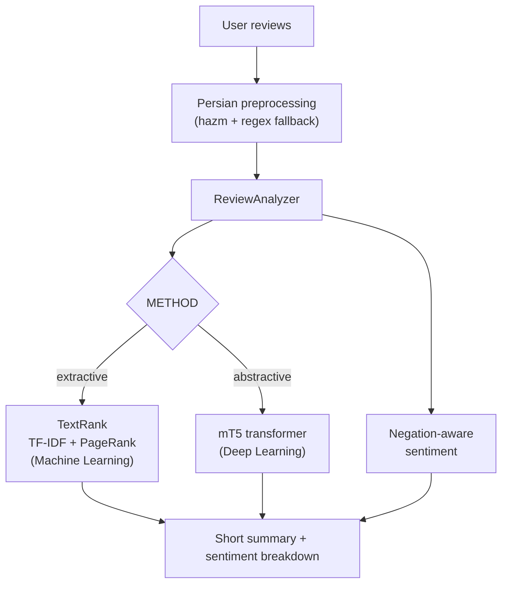

<div align="center">

# Persian Review Summarizer

**An offline, local NLP toolkit that condenses a batch of Persian product reviews into a short summary and a sentiment breakdown — using both classical Machine Learning (TextRank) and Deep Learning (mT5). No cloud, no external API.**

خلاصه‌سازی محلی و آفلاین نظرات فارسی با دو رویکرد یادگیری ماشین و یادگیری عمیق — بدون هیچ سرویس ابری.

[](https://github.com/mehdikhodakarami/persian-review-summarizer-ml/actions/workflows/ci.yml)


</div>

---

## Overview

Persian Review Summarizer takes a set of user reviews (about a product, service, or anything else) and produces:

1. **A concise summary** — the essence of what everyone is saying, in a few sentences.
2. **A sentiment breakdown** — how many reviews are positive, negative, or neutral.

It ships with **two interchangeable summarization engines** behind a single interface, so you can trade off speed vs. fluency by changing one setting:

| Engine | Technique | Paradigm | Model download |
|--------|-----------|----------|----------------|
| **Extractive** (`extractive`) | TextRank — TF-IDF sentence vectors ranked with the PageRank algorithm over a cosine-similarity graph | Unsupervised **Machine Learning** | None — runs instantly |
| **Abstractive** (`abstractive`) | `mT5` sequence-to-sequence transformer with a map-reduce strategy for many reviews | **Deep Learning** | ~2.2 GB on first run, then fully offline |

Everything runs locally. The extractive path needs no model at all; the abstractive path downloads the transformer once and then works with no network.

---

## Features

- 🧹 **Robust Persian preprocessing** — Unicode normalization, Arabic→Persian character mapping, digit normalization, emoji/URL/diacritic removal, sentence segmentation (via `hazm`, with a pure-regex fallback so it never hard-fails).
- 🔹 **Extractive summarization (ML)** — a from-scratch TextRank implementation (TF-IDF + cosine similarity + PageRank) with Persian stop-word filtering.
- 🧠 **Abstractive summarization (DL)** — `mT5` transformer with lazy loading and a map-reduce pipeline that scales to large review sets.
- 📊 **Negation-aware sentiment** — a Persian lexicon that correctly flips constructs like *«خوب نبود»* (“wasn’t good”) to negative.
- 🧩 **Clean architecture** — decoupled layers (preprocessing → summarizer → analyzer → interface) using the Strategy + Factory patterns and dependency injection.
- 🖥️ **Two interfaces** — a Streamlit web UI and a CLI. Also usable as a Python library.
- ✅ **Tested** — 19 unit tests that run without any model download.

---

## How it works



---

## Project structure

```
review-summarizer/
├── summarizer/
│   ├── config.py         # Settings loaded from environment / .env
│   ├── preprocess.py     # Persian normalization + sentence segmentation
│   ├── base.py           # Abstract summarizer interface
│   ├── extractive.py     # TextRank engine (ML)
│   ├── abstractive.py    # mT5 engine (DL)
│   ├── sentiment.py      # Negation-aware lexicon sentiment
│   ├── aggregator.py     # ReviewAnalyzer: summary + sentiment
│   └── engine.py         # Factory that selects the engine
├── app.py                # Streamlit UI
├── cli.py                # Command-line interface
├── tests/                # 19 unit tests
└── data/sample_reviews.csv
```

---

## Installation

```bash
git clone https://github.com/mehdikhodakarami/persian-review-summarizer-ml.git
cd persian-review-summarizer-ml
python -m venv .venv && source .venv/bin/activate
pip install -r requirements.txt
cp .env.example .env
```

> The extractive engine only needs `hazm`, `scikit-learn`, `networkx`, and `pandas`.
> Install `torch` + `transformers` only if you want the abstractive (Deep Learning) engine.

---

## Usage

### Command line
```bash
# From a CSV file (column: text)
python cli.py --file data/sample_reviews.csv

# Reviews passed directly
python cli.py --reviews "کیفیت عالیه" "قیمت گرونه" "پشتیبانی ضعیف بود"

# Use the Deep Learning engine
python cli.py --file data/sample_reviews.csv --method abstractive
```

### Web UI
```bash
pip install streamlit
streamlit run app.py
```

### As a library
```python
from summarizer import ReviewAnalyzer

analyzer = ReviewAnalyzer()               # uses METHOD from .env (default: extractive)
result = analyzer.analyze([
    "کیفیت ساخت عالیه ولی قیمتش گرونه.",
    "باتری خوبی داره و یه روز کامل دووم میاره.",
    "پشتیبانی ضعیف بود و دیر جواب دادن.",
])

print(result.summary)
print(result.sentiment.label, result.sentiment.positive, result.sentiment.negative)
```

### Sample output
```
Summary:
   این گوشی دوربین فوق‌العاده‌ای دارد و کیفیت عکس‌ها در نور کم عالی است...
   کیفیت ساخت گوشی واقعا عالیه و بدنه محکمی داره. صفحه‌نمایش خیلی باکیفیته.
Sentiment: positive=6 | negative=1 | neutral=1  →  mostly positive
```

---

## Configuration

All settings are read from environment variables (or a `.env` file):

| Variable | Default | Description |
|----------|---------|-------------|
| `METHOD` | `extractive` | `extractive` (ML) or `abstractive` (DL) |
| `SUMMARY_SENTENCES` | `3` | Number of sentences in an extractive summary |
| `HF_MODEL_NAME` | `csebuetnlp/mT5_multilingual_XLSum` | Transformer used by the abstractive engine |
| `DEVICE` | `cpu` | `cpu` or `cuda` |
| `MAX_INPUT_LENGTH` / `MAX_OUTPUT_LENGTH` | `1024` / `90` | Token limits for the transformer |
| `NUM_BEAMS` | `4` | Beam-search width |
| `MAX_REVIEWS` | `500` | Safety cap on batch size |

> If model downloads are slow in your region, set `HF_ENDPOINT=https://hf-mirror.com` in `.env`.

---

## Testing

```bash
pytest              # 19 tests, no model download required
```

---

## Roadmap

- Aspect-based summarization (group opinions by feature: battery, camera, price, …).
- Replace the lexicon sentiment with a fine-tuned Persian transformer (e.g. ParsBERT).
- Sentence-embedding-based extractive ranking as a third engine.
- REST API and Docker image for server deployment.

---

## Tech stack

`Python` · `scikit-learn` · `networkx` · `Transformers (mT5)` · `PyTorch` · `hazm` · `Streamlit` · `pandas` · `pytest`

## License

Released under the [MIT License](LICENSE).
