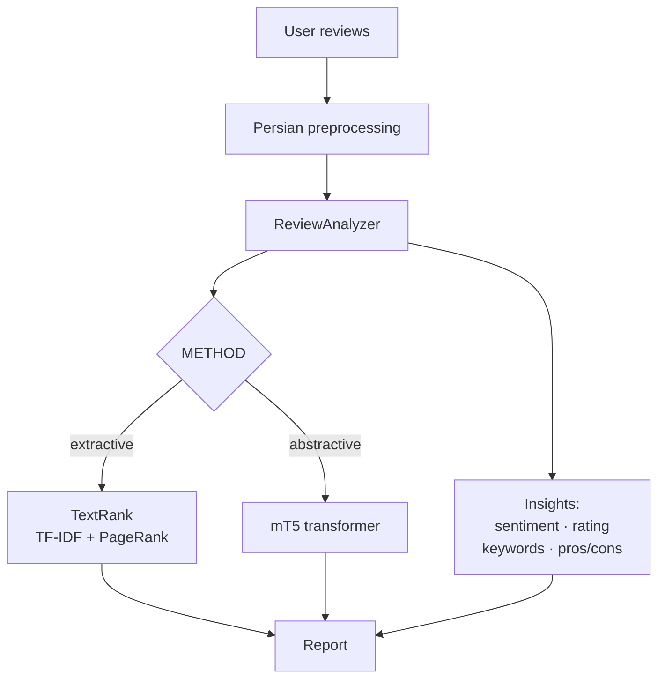

<div align="center">

# Persian Review Summarizer

**Turn a pile of Persian reviews into a clear verdict.** Give it the reviews for a product (or anything else) and it returns a short summary, an estimated star rating, a sentiment breakdown, the most-mentioned keywords, and a pros/cons list — all computed on your own machine.

ابزاری برای جمع‌بندی نظرات فارسی: خلاصه، امتیاز ستاره‌ای، تحلیل احساسات، کلیدواژه‌ها و نکات مثبت/منفی — همه به‌صورت محلی.

[](https://github.com/mehdikhodakarami/persian-review-summarizer-ml/actions/workflows/ci.yml)


</div>

---

## What it does

Feed it a set of reviews and it produces a compact report:

- **📝 Summary** — the gist of what everyone is saying, in a few sentences.
- **⭐ Estimated rating** — a 1–5 star score derived from the overall sentiment.
- **📊 Sentiment breakdown** — how many reviews are positive, negative, or neutral.
- **🏷️ Keywords** — the terms people mention most (extracted with TF-IDF).
- **✅⚠️ Pros & Cons** — the standout positive and negative points, pulled sentence by sentence.

Two summarization engines sit behind one interface, so you pick the trade-off you want by changing a single setting:

| Engine | Technique | Approach | First run |
|--------|-----------|----------|-----------|
| **Extractive** (`extractive`) | TextRank — TF-IDF sentence vectors ranked with PageRank over a similarity graph | Unsupervised **Machine Learning** | Ready instantly, no model needed |
| **Abstractive** (`abstractive`) | `mT5` sequence-to-sequence transformer with a map-reduce pipeline | **Deep Learning** | Downloads the model once (~2.2 GB), then works offline |

Everything runs on-device — the extractive engine needs no download at all, and the abstractive engine only reaches the network once to fetch the transformer.

---

## Features

- 🧹 **Solid Persian preprocessing** — Unicode normalization, Arabic→Persian character mapping, digit normalization, emoji/URL/diacritic removal, and sentence segmentation (via `hazm`, with a regex fallback so it always keeps working).
- 🔹 **Extractive summarization (ML)** — a from-scratch TextRank (TF-IDF + cosine similarity + PageRank) with Persian stop-word filtering.
- 🧠 **Abstractive summarization (DL)** — an `mT5` transformer with lazy loading and a map-reduce pipeline that scales to large review sets.
- 📊 **Negation-aware sentiment** — a Persian lexicon that correctly reads constructs like *«خوب نبود»* (“wasn’t good”) as negative.
- ⭐ **Rating, keywords, and pros/cons** — extra insights layered on top of the summary.
- 🧩 **Clean architecture** — decoupled layers (preprocessing → summarizer → analyzer → interface) using the Strategy + Factory patterns and dependency injection.
- 🖥️ **Three ways to use it** — a Streamlit web app, a CLI, or import it as a Python library.
- ✅ **Tested & CI-checked** — 24 unit tests that run without any model download, on every push.

---

## How it works



---

## Project structure

```
review-summarizer/
├── summarizer/
│   ├── config.py         # Settings loaded from environment / .env
│   ├── preprocess.py     # Persian normalization + sentence segmentation
│   ├── base.py           # Abstract summarizer interface
│   ├── extractive.py     # TextRank engine (ML)
│   ├── abstractive.py    # mT5 engine (DL)
│   ├── sentiment.py      # Negation-aware lexicon sentiment
│   ├── insights.py       # Keywords, pros/cons, rating
│   ├── aggregator.py     # ReviewAnalyzer: ties everything together
│   └── engine.py         # Factory that selects the engine
├── app.py                # Streamlit UI
├── cli.py                # Command-line interface
├── tests/                # 24 unit tests
└── data/sample_reviews.csv
```

---

## Installation

```bash
git clone https://github.com/mehdikhodakarami/persian-review-summarizer-ml.git
cd persian-review-summarizer-ml
python -m venv .venv && source .venv/bin/activate
pip install -r requirements.txt
cp .env.example .env
```

> The extractive engine only needs `hazm`, `scikit-learn`, `networkx`, and `pandas`.
> Install `torch` + `transformers` only if you want the abstractive (Deep Learning) engine.

---

## Usage

### Command line
```bash
# From a CSV file (column: text)
python cli.py --file data/sample_reviews.csv

# Reviews passed directly
python cli.py --reviews "کیفیت عالیه" "قیمت گرونه" "پشتیبانی ضعیف بود"

# Use the Deep Learning engine
python cli.py --file data/sample_reviews.csv --method abstractive
```

### Web app
```bash
pip install streamlit
streamlit run app.py
```

### As a library
```python
from summarizer import ReviewAnalyzer

analyzer = ReviewAnalyzer()               # engine chosen by METHOD in .env
report = analyzer.analyze([
    "کیفیت ساخت عالیه ولی قیمتش گرونه.",
    "باتری خوبی داره و یه روز کامل دووم میاره.",
    "پشتیبانی ضعیف بود و دیر جواب دادن.",
])

print(report.summary)
print(report.rating, report.sentiment.label)
print(report.keywords)
print(report.pros, report.cons)
```

### Sample output
```
📌 Summary:
   این گوشی دوربین فوق‌العاده‌ای دارد و کیفیت عکس‌ها در نور کم عالی است...
   کیفیت ساخت گوشی واقعا عالیه و بدنه محکمی داره. صفحه‌نمایش خیلی باکیفیته.
⭐ Rating: ★★★★☆  (4.2 / 5)
📊 Sentiment: positive=6 | negative=1 | neutral=1  →  mostly positive
🏷️ Keywords: گوشی، کیفیت، صفحه‌نمایش، دوربین، محصول، زود
✅ Pros: کیفیت ساخت گوشی واقعا عالیه و بدنه محکمی داره. …
⚠️ Cons: پشتیبانی فروشگاه اصلا خوب نبود و دیر فرستادن.
```

---

## Configuration

Settings come from environment variables (or a `.env` file):

| Variable | Default | Description |
|----------|---------|-------------|
| `METHOD` | `extractive` | `extractive` (ML) or `abstractive` (DL) |
| `SUMMARY_SENTENCES` | `3` | Sentences in an extractive summary |
| `HF_MODEL_NAME` | `csebuetnlp/mT5_multilingual_XLSum` | Transformer for the abstractive engine |
| `DEVICE` | `cpu` | `cpu` or `cuda` |
| `MAX_INPUT_LENGTH` / `MAX_OUTPUT_LENGTH` | `1024` / `90` | Token limits for the transformer |
| `NUM_BEAMS` | `4` | Beam-search width |
| `MAX_REVIEWS` | `500` | Safety cap on batch size |

> If model downloads are slow in your region, set `HF_ENDPOINT=https://hf-mirror.com` in `.env`.

---

## Testing

```bash
pytest              # 24 tests, no model download required
```

---

## Roadmap

- Aspect-based analysis — group opinions and sentiment by feature (battery, camera, price…).
- Swap the lexicon sentiment for a fine-tuned Persian transformer (e.g. ParsBERT).
- A third engine using sentence embeddings for extractive ranking.
- REST API and a Docker image for server deployment.

---

## Tech stack

`Python` · `scikit-learn` · `networkx` · `Transformers (mT5)` · `PyTorch` · `hazm` · `Streamlit` · `pandas` · `pytest`

## License

Released under the [MIT License](LICENSE).
